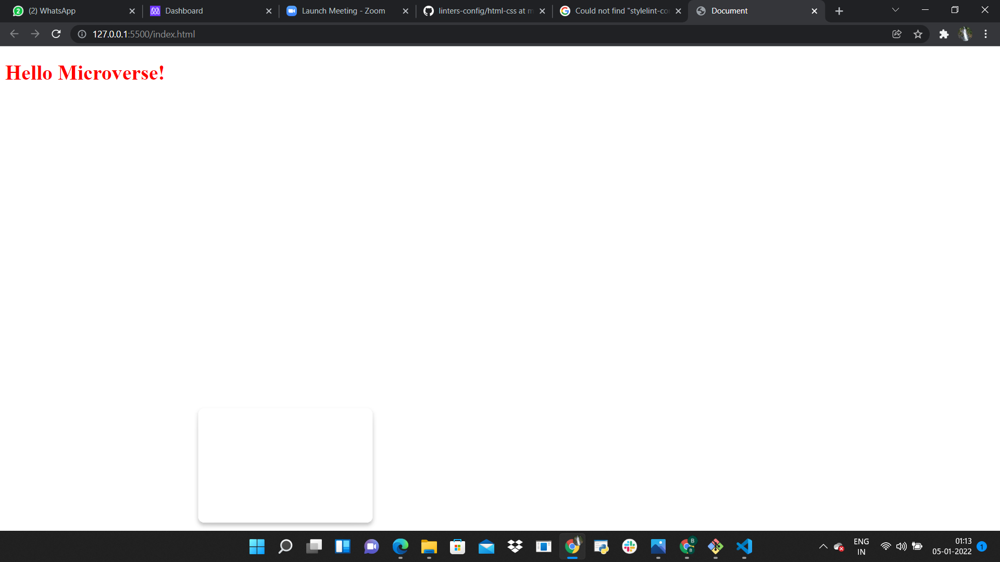

# Hello Microverse Project

> First Microverse Project involving use of Linters, HTML and CSS.

Additional description about the project and its features.

## Built With

- HTML, CSS
- VS Code
- Linters

## Authors

👤 Author1

GitHub: @tanmaytyagi556
Twitter: @Tanmay_Tyagi556
LinkedIn: Tanmay

## 🤝 Contributing

Contributions, issues, and feature requests are welcome!

Feel free to check the [issues page](../../issues/).

## Show your support

Give a ⭐️ if you like this project!

## Acknowledgments

- Hat tip to anyone whose code was used
- Inspiration
- etc

## 📝 License

This project is [MIT](./MIT.md) licensed.
